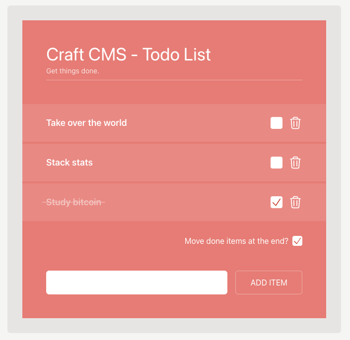

<h1>Craft CMS Sprig TodoList</h1>
## Requirements

RTFM [Craft CMS 4 Requirements](https://craftcms.com/docs/4.x/requirements.html)

## Configs

Duplicate the .env.example file as .env and do your settings! Be sure that your `SITE_URL` points to the `/web` directory.

## DB

Use the todolist.sql as starting point. Create a new database with the settings from your .env file and import the todolist.sql into it. The login credentials are: admin:superuser

## Whats inside?

### Stack

- [Craft CMS](https://craftcms.com/)
- [TailwindCSS](https://tailwindcss.com/)
- [Sprig/htmx](https://htmx.org/)

### Plugins (free)

- [Sprig](https://plugins.craftcms.com/sprig?craft4)
- [Dumper](https://plugins.craftcms.com/dumper?craft4)

### Sections

- Channel - Items

### Highlights

- Sprig/htmx SPA App